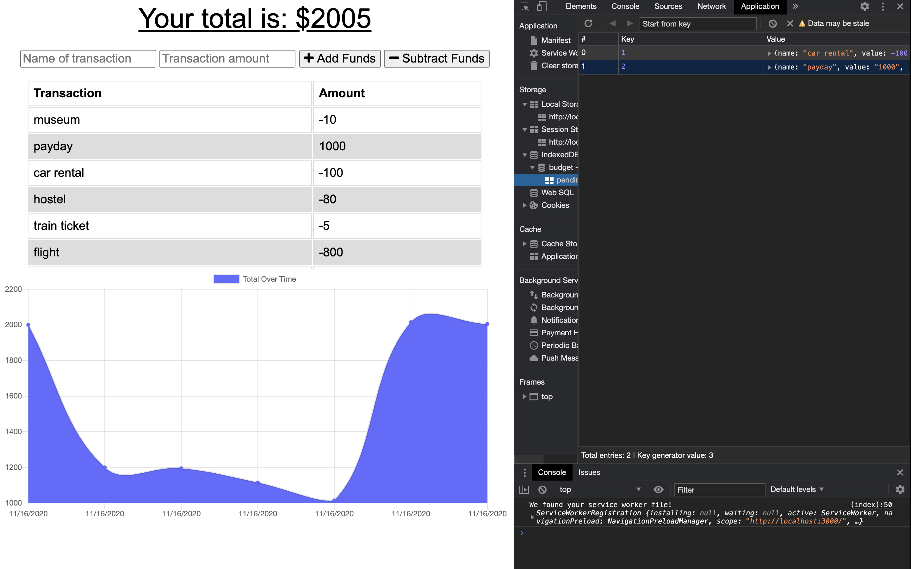

# BudgetTracker
## Description

As an avid traveller, keeping track of your expenses can be key, yet wifi can be hard to come by. 
When travelling, this budget tracker allows you to keep track of your balance, even while offline!
That way you never go over budget, and are able to have fun on your trip without worrying about money!
This app will cache the data you input while offline, and will send it through when you connect to wifi again. 

## Installation
Do npm install, then run it on local host 3000

## Usage 
Use this app whenever youre on a trip and don't have access to phone service but you still want to keep track of your account balance

## Questions
[Link to my Github](https://github.com/ejkennelly)

Contact email address if you have additional questions: elizakennelly@gmail.com

This screenshot shows a working pending indexedDB as well as the working app
